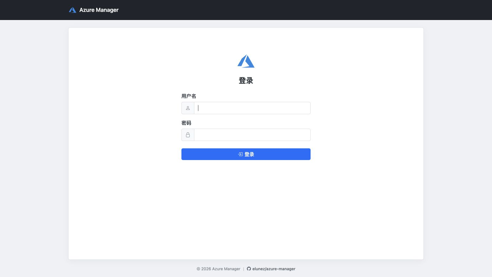
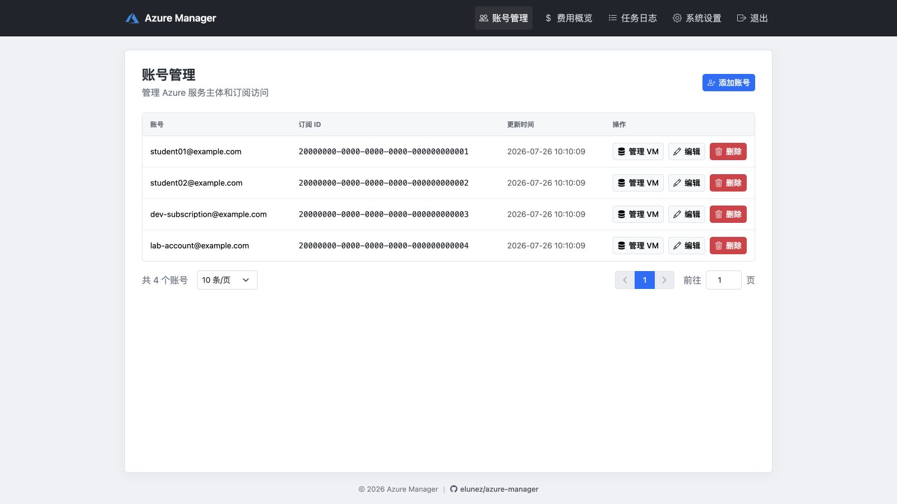
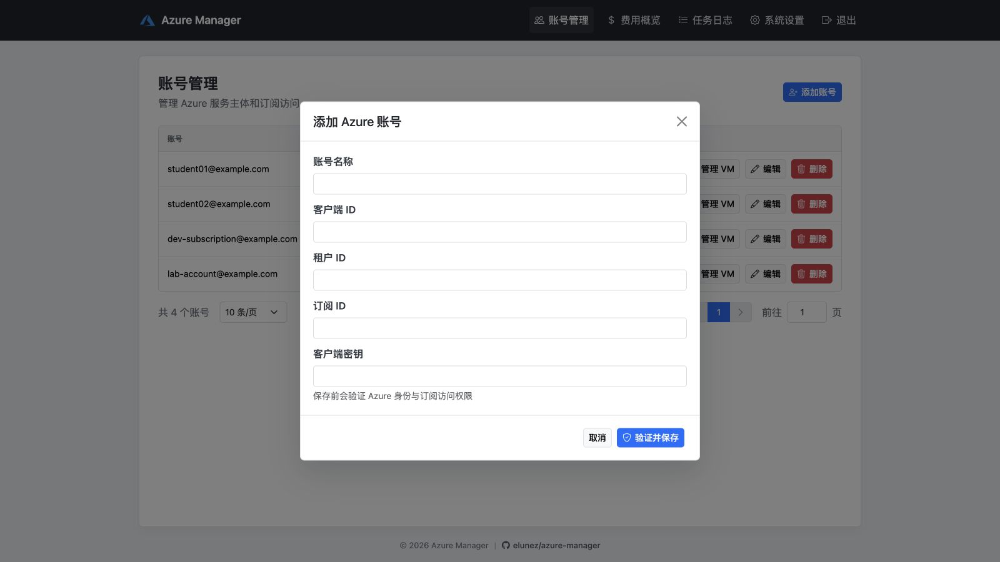
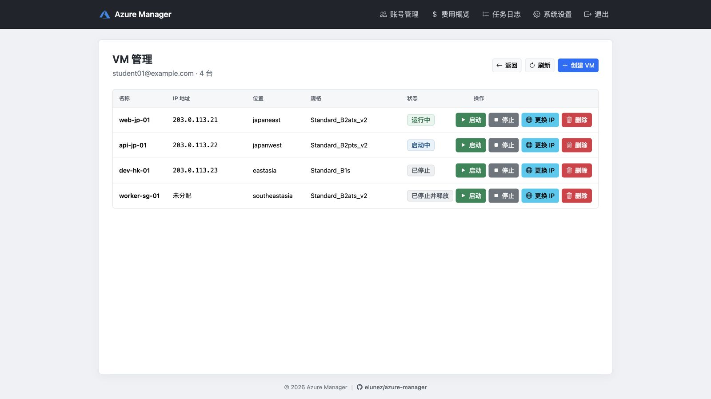
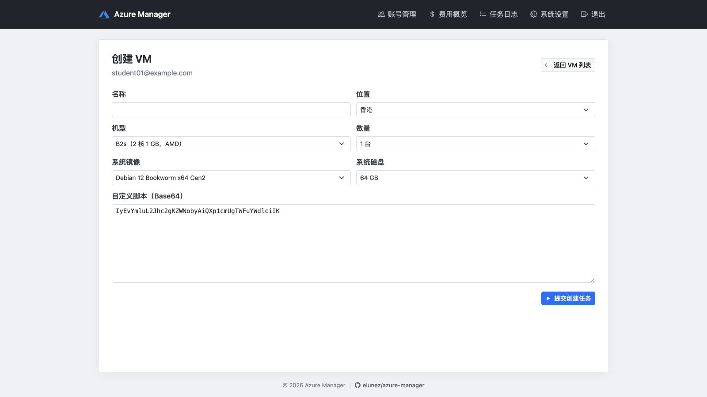
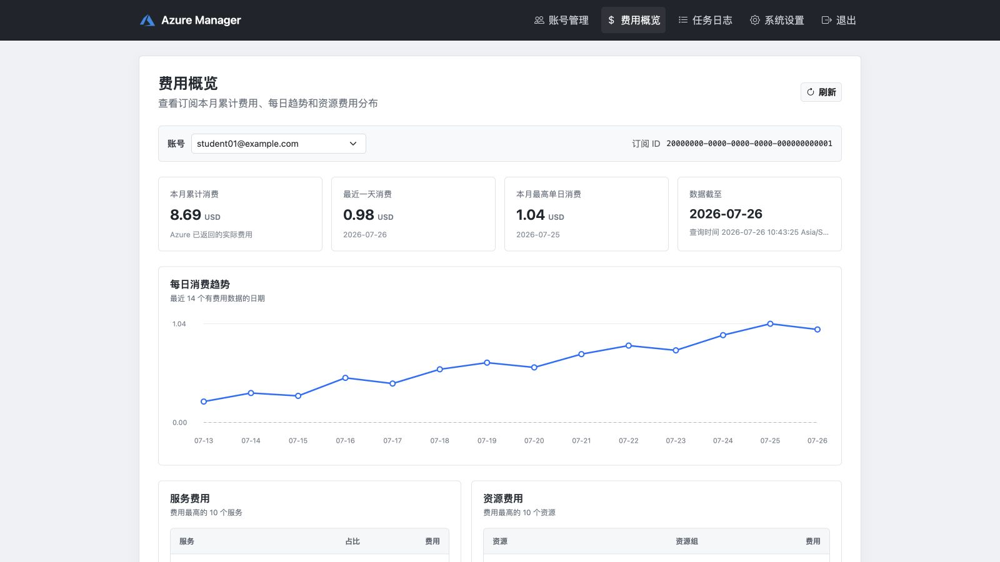
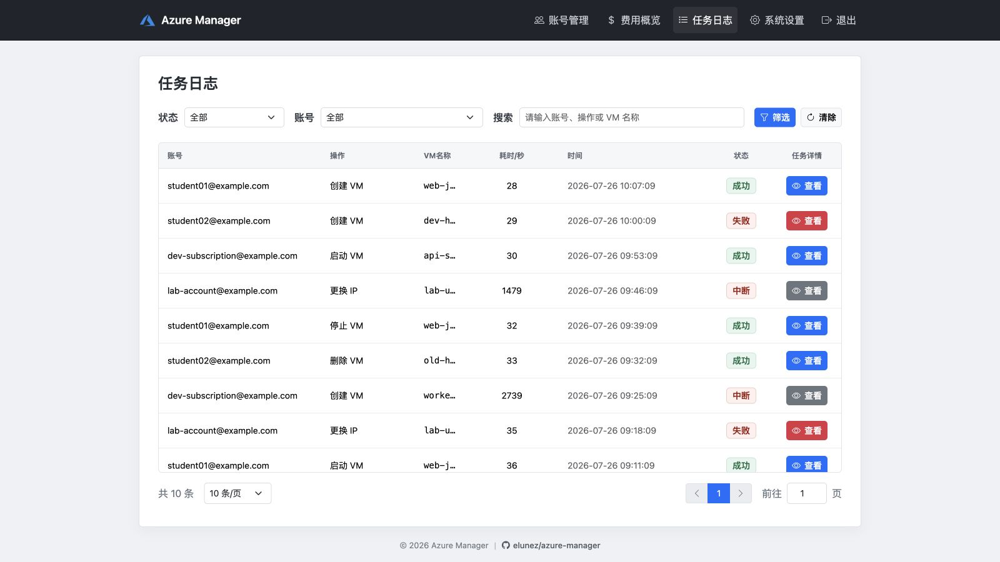
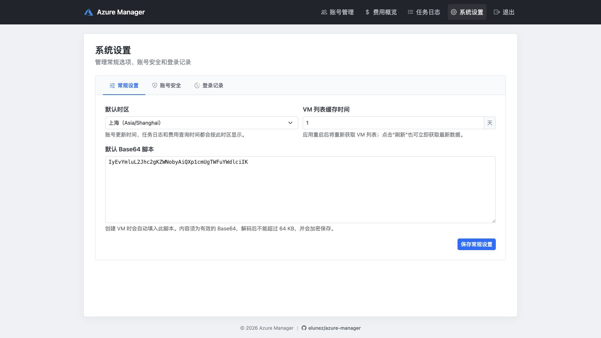
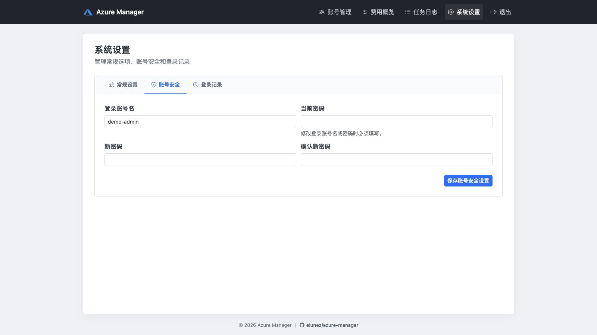
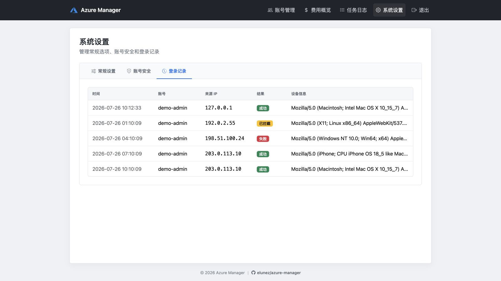

## Azure 管理

在原版的基础上 去广告、汉化等。

原版：https://github.com/1injex/azure-manager

## 界面

管理界面基于 Bootstrap `5.3.7` 和 Bootstrap Icons `1.13.1`，使用 Flask/Jinja2 服务端渲染，不依赖 Node.js 或前端构建流程。静态资源固定在 `azure/static/vendor`，运行时不访问 CDN。

账号新增和编辑使用共享弹窗，删除及高风险 VM 操作使用确认弹窗，Flask Flash 消息使用紧凑 Toast 展示。

### 登录



### 账号管理



### 添加 Azure 账号



### VM 管理



### 创建 VM



### 费用概览



### 任务日志



### 系统设置：常规设置



### 系统设置：账号安全



### 登录记录



## 使用方法

```bash
docker run -itd --name az \
--restart always \
-p 18888:18888 \
-v /path/to/azure-data:/root/azure \
ghcr.io/elunez/azure-manager:latest
```

镜像同时支持 `linux/amd64` 和 `linux/arm64`，两种架构使用相同标签，Docker 会根据宿主机架构自动选择对应镜像。

## 自动构建镜像

GitHub Actions 会使用仓库中的 `Dockerfile` 自动构建多架构镜像，并发布到 GitHub Container Registry：

- 推送到 `master` 分支时，发布 `latest`、`master` 和提交哈希标签。
- 推送以 `v` 开头的 Git 标签时，发布对应版本标签，例如 `v1.0.0`。
- Pull Request 只验证镜像能否成功构建，不会推送镜像。
- 也可以在 GitHub Actions 页面手动触发构建。

首次发布后，需要在 GitHub Packages 设置中确认 `azure-manager` 容器镜像为公开状态，否则拉取前需要先登录 GHCR：

```bash
docker login ghcr.io
```

## 数据与主密钥

容器以 `/root/azure` 为当前启动目录。首次启动会在该目录生成：

- `database.db`：账号和任务数据。
- `.master-key`：Azure 客户端密钥的加密主密钥，文件权限为 `0600`。

必须持久化整个 `/root/azure` 目录，并同时备份这两个文件。丢失 `.master-key` 后，已有 Azure 凭据无法恢复。

也可以通过环境变量提供主密钥，环境变量优先于文件：

```bash
docker run -itd --name az \
--restart always \
-p 18888:18888 \
-v /path/to/azure-data:/root/azure \
-e AZURE_MANAGER_MASTER_KEY='请替换为随机强密钥' \
ghcr.io/elunez/azure-manager:latest
```

本地使用 `python azure/app.py` 启动时，`.master-key` 保存在命令执行时的当前目录。不要提交或公开该文件。

生产容器使用 Gunicorn 单 Worker、`gthread` 和 4 个线程运行。单 Worker 用于保持任务队列、费用缓存、VM 缓存及登录限速状态的一致性。

### 错误排查

页面遇到未预期异常时，只会显示通用提示和错误编号，不会返回服务器路径、SDK 响应或异常堆栈。请根据页面显示的错误编号查看容器日志：

```bash
docker logs az
```

日志会记录相同的错误编号、完整异常和堆栈，便于定位对应请求。任务日志同样只保存通用提示和错误编号，不会保存未知异常的原始内容。

应用默认启用安全 Session Cookie，须通过 HTTPS 访问。仅在本地 HTTP 调试时可以临时关闭：

```bash
AZURE_MANAGER_SECURE_COOKIE=false python azure/app.py
```

Nginx 反向代理示例：

```nginx
location / {
    client_max_body_size 256k;
    proxy_pass http://127.0.0.1:18888;
    proxy_set_header Host $host;
    proxy_set_header X-Real-IP $remote_addr;
    proxy_set_header X-Forwarded-For $proxy_add_x_forwarded_for;
    proxy_set_header X-Forwarded-Proto $scheme;
}
```

`-p 18888:18888` 会在宿主机所有网络接口上发布端口。请通过防火墙限制访问，不要直接向公网开放 `18888`，仅允许 Nginx Proxy Manager 所在主机或可信网络访问。

## 重置管理密码

```bash
docker exec -it az flask admin 用户名 密码
```

### VM 登录凭据

每台 VM 都会生成独立的随机用户名和强密码。创建成功后，可在“任务日志”的对应任务详情中查看登录凭据。任务日志会以明文保存该凭据，请限制数据库文件和管理页面的访问权限。

### 创建 VM 的兼容性说明

- 公网 IP 使用 Azure Standard SKU；Basic SKU 已由 Azure 退役。
- 新建 VM 不指定可用性区域，由 Azure 自动放置。
- 默认 Linux 镜像为 Debian 12 Bookworm x64 Gen2；同时提供 Debian 12 ARM64 和 Ubuntu Server 24.04 LTS。ARM 机型仅可使用 ARM64 镜像。
- 更换 IP 会自动识别地址分配方式：Dynamic IP 通过停机再启动更换；Static IP 会创建替换 IP、更新 NIC 绑定，再删除旧 IP。
- 创建失败时会在应用日志保留 Azure 原始异常，并自动删除该次创建的资源组，避免残留资源计费。
- 页面导航中的“任务日志”会分页保留创建、删除、启动、停止和换 IP 的任务结果。
- 应用启动时会自动补建缺失的数据表，不会删除已有账号或日志数据。

### 管理账户

提取API教程：https://www.ydyno.com/archives/1394.html

页面使用账号名称、客户端 ID、客户端密钥、租户 ID 和订阅 ID 五个独立字段。客户端密钥加密后保存；编辑账号时将密钥留空即可保留原值，填写新值则会先验证 Azure 身份再更新。

### 费用概览

“费用概览”通过 Azure Cost Management REST API 查询订阅的本月累计消费、每日趋势及服务和资源费用明细。页面异步加载数据，并将成功结果缓存 30 分钟；点击“刷新”会跳过缓存重新查询。

同一账号的费用查询会串行执行，避免多个页面同时请求 Azure。发生 429 限流时，应用会进入至少 60 秒的冷却期；存在历史缓存时优先展示缓存数据。

服务主体需要在对应订阅范围拥有 `Cost Management Reader` 角色。可以在 Azure Portal 的“订阅 → 访问控制 (IAM) → 添加角色分配”中授权。权限刚授予时可能需要等待 Azure 完成同步。

Azure for Students 的 Credit 余额不属于 Cost Management 返回范围：

- Azure for Students 和 Azure for Students Starter 报价不支持 Cost Management API，页面会展示官方查询入口，不会将其误报为权限错误。应用会把该结果记录到账号表，后续进入页面时不再重复调用 Azure；点击“刷新”可以手动重新检测。
- 免费层内的未计费服务不会产生费用，可能不会出现在费用明细中。
- 使用学生 Credit 抵扣的收费资源仍会显示费用，不能用本页金额直接判断官方剩余额度。
- 学生订阅准确余额和到期时间请前往 [Microsoft Azure Sponsorships](https://www.microsoftazuresponsorships.com/) 查询。
- VM 的计算规格免费不代表附属资源免费，托管磁盘、公网 IP、快照和出站流量仍可能单独收费。

费用数据由 Azure 异步汇总，可能晚于资源实际使用时间。

### 系统设置

登录后可通过“系统设置”的 TAB 分别管理常规设置、账号安全和登录记录。默认时区为 `Asia/Shanghai`；数据库时间仍以 UTC 保存，账号更新时间、任务日志和费用查询时间会在页面按当前用户选择的时区转换显示。账号管理和任务日志默认每页显示 `10` 条，桌面端可在对应页面临时切换为 `20` 或 `50` 条。

常规设置可以保存创建 VM 时自动填入的 Base64 脚本。脚本使用主密钥加密存储，解码后不能超过 64 KB；创建时临时修改或清空只影响当前任务，不会覆盖默认设置。

VM 列表按设置的 `1` 至 `30` 天有效期缓存在应用进程内，重启后自动清空。点击 VM 管理页的“刷新”会立即重新查询 Azure；账号凭据更新、账号删除或 VM 创建、启动、停止、更换 IP、删除成功后，也会自动清除对应账号的缓存。

### 登录安全

同一来源 IP 在 5 分钟内登录失败 5 次，或同一账号在 15 分钟内失败 10 次后，将临时锁定 15 分钟。锁定状态保存在当前进程内，应用重启后清空。

登录成功、失败及被限速拦截的事件会写入登录审计，最多保留最近 2000 条，可在“系统设置 → 登录记录”中分页查看。Session Cookie 默认启用 `Secure`、`HttpOnly` 和 `SameSite=Lax`，登录 Session 有效期为 8 小时。

应用请求体最大为 `256 KB`。Nginx 应配置相同的 `client_max_body_size`，在请求进入应用前拒绝超大表单。
